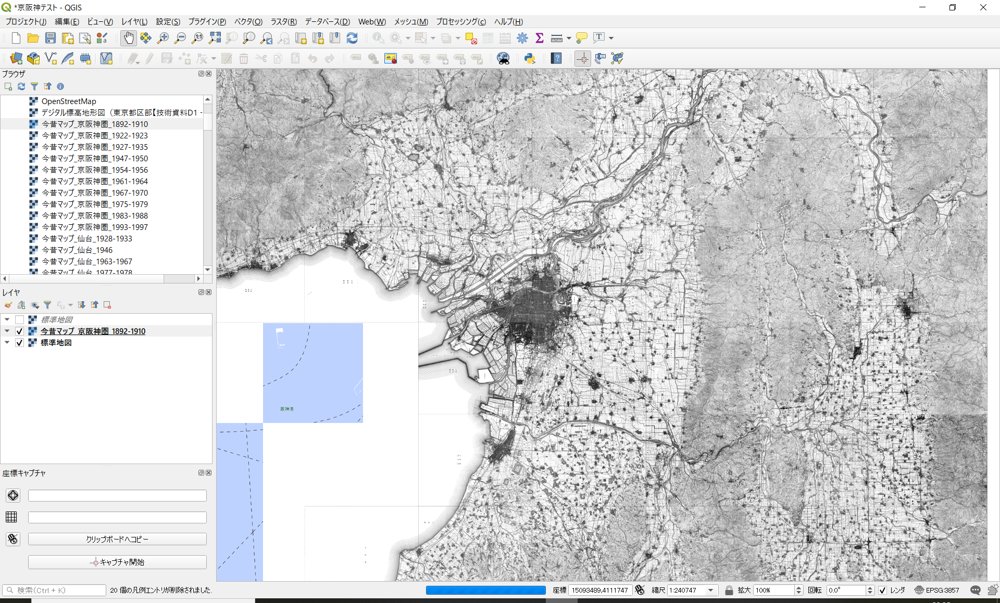

　
# QGIS向け：　今昔マップのXYZ-TilesのXMLデータ・データセット

## 概　 要    
QGISへXYZ-TilesのAPIを使って，今昔マップの旧版地形図を表示させるためxmlデータセットです．
このxmlファイルを使うと一括登録ができます．  

本データセットは2021年3月1日現在の『[今昔マップ on the web](http://ktgis.net/kjmapw/tilemapservice.html   "今昔マップ on the web")』[1]で公開されている地域を収録しています．

 

## データセット概要     
+ **データ形式**：　KML（Keyhole Markup Language）  
+ **構成**：　「XYZ_tile」フォルダの配下にあるkmlに，それぞれの地域のタイルマップが格納されています．

## 利用方法

1. ダウンロードは画面右上の「code」のボタンを押すとzip形式で本リポジトリ内のドキュメントが全てダウンロードされます．
1. zipを解凍すると「XYZ_tile」フォルダ内のkmlファイルを取得できます．
1. QGISを立ち上げ，「XYZ_tile」>「接続をロード」からお好みのkmlファイルを読み込んでください．

## 簡単なチュートリアル  
noteの以下の記事を御覧ください．  
https://note.com/smatsu/n/ne3f862f37401?magazine_key=m3a14836a1e82

## 引用 

1. 谷謙二: 時系列地形図閲覧サイト「今昔マップ on the web」  
 http://ktgis.net/kjmapw/index.html  

## ライセンス（著作権について）
* このデータセットはクリエイティブ・コモンズの[**CC BY-NC-SA 4.0**（表示 - 非営利 - 継承 4.0 国際）](https://creativecommons.org/licenses/by-nc-sa/4.0/deed.ja)の下に提供されています．

　　　　　

* CC BY-NC-SA 4.0条件であれば連絡は不要ですが，出版などの商用・営利目的で利用されたい場合には連絡をお願いいたします．  

## コンタクト先
動作確認などに不具合が認められる場合，商用・営利目的での利用は「コンタクト先」でご連絡をいただければ幸いです．  
japan.road.jp@gmail.com （国道愛好家　松波宛）
  
## 履歴  
2021.04.29　東予・庄内追加  
2021.03.02　公開  
